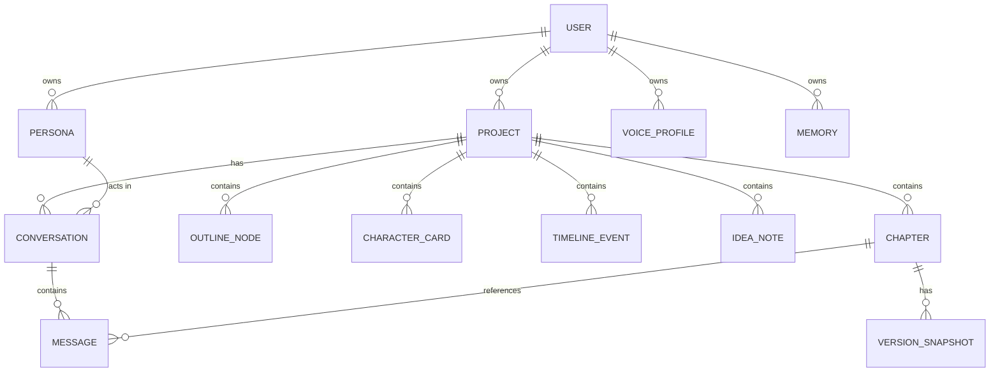
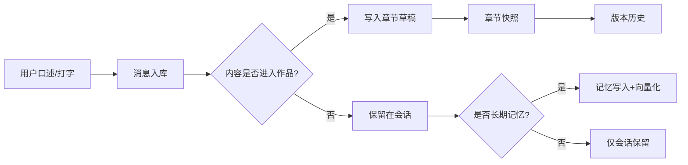

# 数据模型设计：Aicho Muse

> 本文定义核心实体、字段与关系。MVP 聚焦 `users / projects / chapters / personas / voices / messages`，M2+ 增加记忆与素材。

## 1. 实体关系概览

## 2. 核心表结构

### 2.1 users 用户

| 字段 | 类型 | 说明 |
| --- | --- | --- |
| id | UUID | 主键 |
| email | text | 唯一，登录邮箱 |
| password_hash | text | 可选（OAuth 用户为空） |
| display_name | text | 显示名 |
| locale | text | 默认 zh-CN |
| created_at / updated_at | timestamptz | 时间戳 |
| deleted_at | timestamptz | 软删除 |

### 2.2 projects 创作项目

| 字段 | 类型 | 说明 |
| --- | --- | --- |
| id | UUID | 主键 |
| user_id | UUID FK | 所属用户 |
| title | text | 作品标题 |
| genre | enum | biography / fiction / prose / poetry / script |
| theme | text | 一句话主题 |
| target_audience | text | 目标读者 |
| goal_word_count | int | 创作目标字数 |
| status | enum | drafting / revising / finished |
| default_persona_id | UUID FK | 默认陪跑人设 |
| created_at / updated_at | timestamptz | 时间戳 |

### 2.3 chapters 章节

| 字段 | 类型 | 说明 |
| --- | --- | --- |
| id | UUID | 主键 |
| project_id | UUID FK | 所属项目 |
| title | text | 章节标题 |
| order_index | int | 排序 |
| content | text | 章节正文（Markdown） |
| word_count | int | 正文字数（维护值） |
| status | enum | draft / reviewed / final |
| created_at / updated_at | timestamptz | 时间戳 |

### 2.4 personas 人设卡

| 字段 | 类型 | 说明 |
| --- | --- | --- |
| id | UUID | 主键 |
| user_id | UUID FK | 创建者 |
| name | text | 人设名 |
| tagline | text | 一句话定位 |
| avatar_url | text | 头像 |
| background | text | 背景故事 |
| personality | jsonb | 性格特质数组 |
| speaking_style | jsonb | 语气/偏好/禁忌 |
| values | jsonb | 价值观数组 |
| relationship | text | 与用户的关系 |
| expertise | jsonb | 擅长领域数组 |
| greeting | text | 开场白 |
| is_preset | bool | 是否官方预设 |
| version | int | 人设版本 |
| created_at / updated_at | timestamptz | 时间戳 |

### 2.5 voice_profiles 声色卡

| 字段 | 类型 | 说明 |
| --- | --- | --- |
| id | UUID | 主键 |
| user_id | UUID FK | 创建者 |
| display_name | text | 音色名 |
| provider | text | TTS 提供商 |
| voice_id | text | 厂商音色 ID |
| params | jsonb | rate/pitch/emotion/energy |
| speech_notes | text | 口语化演绎备注 |
| features | jsonb | 能力标记数组 |
| is_preset | bool | 是否官方预设 |
| created_at / updated_at | timestamptz | 时间戳 |

### 2.6 conversations 会话

| 字段 | 类型 | 说明 |
| --- | --- | --- |
| id | UUID | 主键 |
| project_id | UUID FK | 关联项目 |
| persona_id | UUID FK | 使用的人设 |
| voice_profile_id | UUID FK | 使用的声色 |
| title | text | 会话标题（自动生成） |
| created_at / updated_at | timestamptz | 时间戳 |

### 2.7 messages 消息

| 字段 | 类型 | 说明 |
| --- | --- | --- |
| id | UUID | 主键 |
| conversation_id | UUID FK | 所属会话 |
| role | enum | user / assistant / system |
| content | text | 消息正文 |
| reply_type | enum | question / feedback / suggestion / encouragement / other（助手消息） |
| tool_used | text | 触发的工具（如 rewrite） |
| audio_url | text | 关联的 TTS 音频 |
| created_at | timestamptz | 时间戳 |

### 2.8 version_snapshots 版本快照

| 字段 | 类型 | 说明 |
| --- | --- | --- |
| id | UUID | 主键 |
| chapter_id | UUID FK | 所属章节 |
| content | text | 完整正文快照 |
| note | text | 变更说明 |
| created_at | timestamptz | 时间戳 |

## 3. M2+ 扩展表

### 3.1 outline_nodes 大纲节点

| 字段 | 类型 | 说明 |
| --- | --- | --- |
| id | UUID | 主键 |
| project_id | UUID FK | 所属项目 |
| parent_id | UUID FK | 父节点（树形） |
| title | text | 节点标题 |
| summary | text | 节点内容概述 |
| order_index | int | 排序 |
| chapter_id | UUID FK | 关联章节（可空） |

### 3.2 character_cards 人物设定卡

| 字段 | 类型 | 说明 |
| --- | --- | --- |
| id | UUID | 主键 |
| project_id | UUID FK | 所属项目 |
| name | text | 人物名 |
| role | text | 主角/配角/反派 |
| description | text | 人物描述 |
| arc | text | 人物弧光 |
| relationships | jsonb | 与其他人物关系 |

### 3.3 timeline_events 时间线

| 字段 | 类型 | 说明 |
| --- | --- | --- |
| id | UUID | 主键 |
| project_id | UUID FK | 所属项目 |
| when | text | 时间表述（虚构时间线） |
| event | text | 事件描述 |
| importance | int | 1–5 |
| linked_chapters | jsonb | 关联章节 ID 数组 |

### 3.4 idea_notes 灵感碎片

| 字段 | 类型 | 说明 |
| --- | --- | --- |
| id | UUID | 主键 |
| project_id | UUID FK | 可空（未归类的灵感到"灵感箱"） |
| content | text | 灵感内容 |
| tags | jsonb | 标签数组 |
| source | enum | voice / text / imported |
| created_at | timestamptz | 时间戳 |

### 3.5 memories 长期记忆

| 字段 | 类型 | 说明 |
| --- | --- | --- |
| id | UUID | 主键 |
| user_id | UUID FK | 所属用户 |
| scope | enum | user / project |
| project_id | UUID FK | 项目级记忆关联（可空） |
| key | text | 记忆键（如 writing_style） |
| content | text | 记忆内容 |
| embedding | vector(1024) | 向量（Qdrant） |
| importance | int | 1–5 |
| created_at / updated_at | timestamptz | 时间戳 |

## 4. 索引与约束

- users.email 唯一索引。
- projects(user_id, status) 复合索引。
- chapters(project_id, order_index) 复合索引，唯一约束。
- messages(conversation_id, created_at) 复合索引。
- conversations(project_id, updated_at) 复合索引。
- personas(user_id) 与 voice_profiles(user_id) 索引。
- 外键统一 ON DELETE CASCADE（项目删除级联章节、会话、快照；用户删除级联全部）。

## 5. 字段约定

- 所有 ID 使用 UUIDv7（时间有序，利于索引与分页）。
- 所有文本字段禁止空串（NULL 或有效内容）。
- 时间统一 UTC 存储、客户端本地化展示。
- jsonb 字段结构在应用层校验，数据库层只做 JSON 合法性检查。

## 6. 数据生命周期

## 7. 与既有 Aicho 的协同

- 用户体系独立（本项目是独立 Web 应用），后续如需打通 Aicho 账号再做联合登录。
- 数据模型保持独立演进，避免与 Aicho 情感日记耦合；共享的只有"人设/语音"概念的经验。
