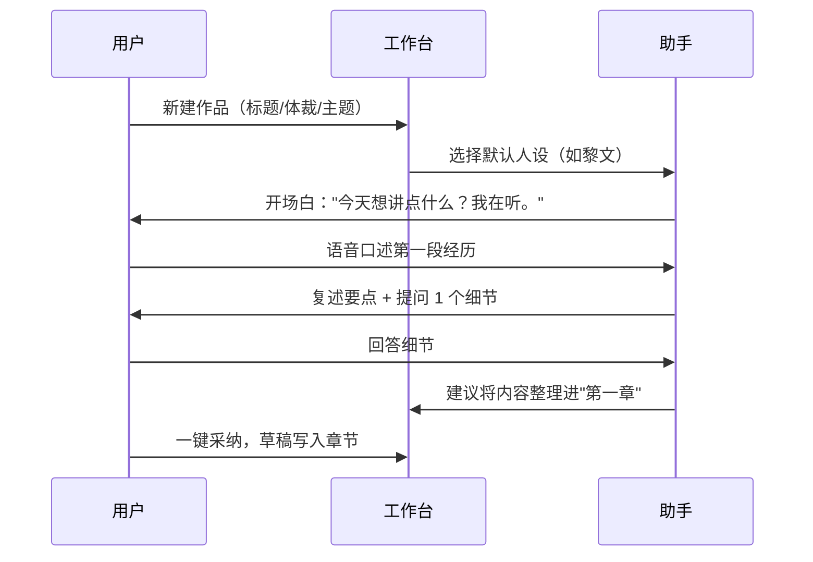

# 界面与交互设计：Aicho Muse

> 目标：让"用对话创作"像聊天一样自然。语音与打字平等，作品信息随时可见、不打断对话。

## 1. 设计语言

- **气质**：纸与墨的文艺感 + 现代数字产品的轻盈。米白底、深灰字、暖色点缀。
- **字体**：中文衬线（思源宋体）用于作品正文，界面文字用无衬线（思源黑体/系统栈）。
- **深色模式**：提供暖调深色（避免纯黑，保护夜间创作时的眼睛）。
- **动效**：克制。消息进入淡入，语音播放时波形动画，其余尽量少。
- **无障碍**：文字对比度 ≥ WCAG AA；全部功能可键盘操作；语音提示需同时有文字。

## 2. 信息架构

```text
Aicho Muse
├── 首页（项目列表 / 最近会话 / 新建）
├── 工作台（核心）
│   ├── 左侧：项目结构（大纲 · 章节 · 人物 · 时间线 · 灵感箱）
│   ├── 中间：对话区（语音/文字）
│   └── 右侧：作品编辑区（当前章节 + 写作工具）
├── 助手管理
│   ├── 人设列表 / 编辑
│   └── 声色列表 / 编辑
└── 设置
    ├── 账号与隐私
    ├── 语音偏好（引擎 · 播放倍速）
    └── 导出
```

响应式：桌面三栏；平板两栏（隐藏右侧）；手机单栏（Tab 切换"对话/作品/结构"）。

## 3. 页面与组件设计

### 3.1 首页

- 顶部：Logo（Aicho Muse）、新建作品、助手管理入口。
- 作品卡片：封面渐变色（按体裁）、标题、进度、最近更新、继续创作按钮。
- 最近会话列表：直接回到上次没聊完的对话。

### 3.2 工作台（三栏）

**左侧项目结构**
- 折叠树：大纲 → 章节。当前章节高亮，点击切换右侧编辑区。
- 快捷入口：人物卡、时间线、灵感箱（badge 显示条数）。
- 底部：作品设置（体裁/目标字数/进度条）。

**中间对话区**
- 顶部：人设头像 + 姓名 + 一句定位；当前作品名。
- 消息气泡：用户靠右、助手靠左（带头像）。助手消息带"回复类型"标签（提问/反馈/建议/鼓励）与语音播放按钮。
- 输入区：文字输入框 + 麦克风按钮（按住说话/点击开始）、发送；语音模式显示波形与转写预览。
- 快捷操作条：@作品 引用当前章节、插入灵感碎片、"帮我润色" 等快捷指令。

**右侧作品编辑区**
- 章节标题 + 字数统计 + 自动保存状态（已保存/保存中）。
- Markdown 编辑器（写作时聚焦）。
- 工具栏：润色 / 扩写 / 续写 / 风格迁移 / 导出。
- 版本历史抽屉：时间线 + 恢复按钮。

### 3.3 人设管理

- 人设卡片网格：预设（可克隆编辑）与自定义。
- 编辑页分步：基本信息 → 背景与性格 → 说话风格（含"口头禅"与"避免说"）→ 试聊预览。
- 试聊预览：右侧小窗立即用当前配置对话，人设不落库。

### 3.4 声色管理

- 音色列表：播放试听、参数滑杆（语速/音调/情绪/强度）。
- 编辑页：提供商选择、音色选择、参数微调、试听句（固定文案便于对比）。
- 绑定：每个会话选择"人设 + 声色"组合；未绑定时用默认组合。

## 4. 核心交互流程

### 4.1 新建作品 → 首次对话



### 4.2 语音对话循环

```text
按住麦克风 → 录音 → 松开 → 转写预览（可改） → 发送
→ 助手文本流式出现 → （可选）自动朗读 → 可点击重听/倍速/停止
```

- 录音中若检测到静音 2 秒，自动结束并进入转写。
- 转写后先让用户确认再发送（防识别错误），设置中可开启"自动发送"。
- 助手朗读期间用户开始说话 → 立即停止播放（打断）。

### 4.3 采纳与成稿

- 助手建议写入章节时，对话气泡显示"写入章节"按钮。
- 点击后内容进入右侧编辑区（仍可修改），并在对话中标记"已采纳到《第 N 章》"。
- 每个章节有"初稿 → 修改中 → 已定稿"状态，用户手动推进。

## 5. 语音体验细节

- 助手的语音是对文本的"口语化演绎"：保持要点、调整句长与语气词，不改变内容。
- 长回复分段播放：先播放首段（≤ 25 秒），同时继续合成后续。
- 播放状态：波形动画 + 当前句高亮；支持 0.75 / 1 / 1.25 倍速。
- 音色切换即时生效，下一句起用新音色。

## 6. 空状态与新手引导

- 首次进入：三步引导（选人设 → 新建作品 → 说第一句）。
- 空项目：展示示例开场："试试口述一个你最想讲的故事片段。"
- 灵感箱空：说明用途（"随手一句话也可能成为故事的核心。"）
- 引导不弹窗阻断：全部用界面内嵌提示。

## 7. 关键可用性约束

- 从打开 App 到说出第一句 ≤ 3 步。
- 转写中不阻塞输入框，可随时改为打字。
- 所有破坏性操作（删除项目/章节/回滚）需二次确认，且提供 30 秒撤销。
- 断网时：文字草稿本地保存，联网后自动同步；语音功能提示"暂不可用"。
- 加载状态：SSE 流式回复必须有光标/波形反馈，不能静默等待。
